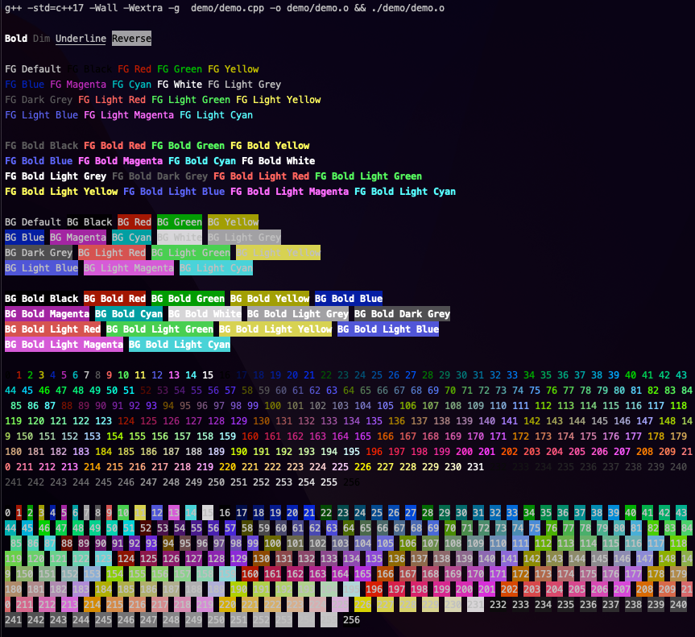

# Table of Contents
1) [TermStylist](#termstylist)
2) [Installation](#installation)
3) [Usage (Default Syntax)](#usage-default-syntax)
4) [Usage (Objects Syntax)](#usage-objects-syntax)
5) [Examples](#examples)
6) [Terminal Compatibility](#terminal-compatibility)
7) [License](#license)

# 🎨 TermStylist


*Screenshot above is running demo.cpp in iTerm2.*

TermStylist is a simple terminal colours library that is header-only. Feel free to submit any issues or possible improvements that you may have.

Enjoy!

# Installation

Clone the repository.

```bash
git clone <SSH/HTTPS URL>
```

Then go to the directory `TermStylist/include` and copy `termstylist.h` into your project.

**or alternatively:**

1) Go to releases on the right-hand side of this repository.
2) Find the latest version available for the library.
3) Download the `termstylist.h` file.
4) Copy `termstylist.h` to your project.

# Usage (Default Syntax)

The ANSI escape codes are split into 6 categories:

1) Attributes
2) Reset 
3) Foreground colours - 8/16 colours (FGColours816)
4) Background colours - 8/16 colours (BGColours816)
5) Foreground colours - 256 colours (FGColours256)
6) Background colours - 256 colours (BGColours256)

TermStylist uses `ostream` overloads with a function that returns an output stream containing the string of the ANSI escape code.

**Remember to reset your attributes/colours using the Reset syntax (i.e., `termstylist::RESET_Default`) or the default syntax correlated to the colour type you're using (i.e., `termstylist::FG_Default`).

--- 

**ATTRIBUTES:**

1) Bold (`termstylist::ATTRS_Bold`)
2) Dim (`termstylist::ATTRS_Dim`)
3) Underline (`termstylist::ATTRS_Underline`)
4) Reverse (`termstylist::ATTRS_Reverse`)

**RESET:**

1) Default (`termstylist::RESET_Default`)
2) Bold (`termstylist::RESET_Bold`)
3) Dim (`termstylist::RESET_Dim`)
4) Underline (`termstylist::RESET_Underline`)
5) Reverse (`termstylist::RESET_Reverse`)

**Foreground colours - 8/16 colours (FGColours816):**

*8 colours:*

1) Default (`termstylist::FG_Default`)
2) Black (`termstylist::FG_Black`)
3) Red (`termstylist::FG_Red`)
4) Green (`termstylist::FG_Green`)
5) Yellow (`termstylist::FG_Yellow`)
6) Blue (`termstylist::FG_Blue`
7) Magenta (`termstylist::FG_Magenta`)
8) Cyan (`termstylist::FG_Cyan`)
9) White (`termstylist::FG_White`)
10) Light Grey (`termstylist::FG_LightGrey`)
11) Dark Grey (`termstylist::FG_DarkGrey`)
13) Light Red (`termstylist::FG_LightRed`)
14) Light Green (`termstylist::FG_LightGreen`)
15) Light Yellow (`termstylist::FG_LightYellow`)
16) Light Blue (`termstylist::FG_LightBlue`)
17) Light Magenta (`termstylist::FG_LightMagenta`)
18) Light Cyan (`termstylist::FG_LightCyan`)

*16 colours (bold, aka bright):*

1) Bold Black (`termstylist::FG_BoldBlack`)
2) Bold Red (`termstylist::FG_BoldRed`)
3) Bold Green (`termstylist::FG_BoldGreen`)
4) Bold Yellow (`termstylist::FG_BoldYellow`)
5) Bold Blue (`termstylist::FG_BoldBlue`)
6) Bold Magenta (`termstylist::FG_BoldMagenta`)
7) Bold Cyan (`termstylist::FG_BoldCyan`)
8) Bold White (`termstylist::FG_BoldWhite`)
9) Bold Light Grey (`termstylist::FG_BoldLightGrey`)
10) Bold Dark Grey (`termstylist::FG_BoldDarkGrey`)
11) Bold Light Red (`termstylist::FG_BoldLightRed`)
12) Bold Light Green (`termstylist::FG_BoldLightGreen`)
13) Bold Light Yellow (`termstylist;:FG_BoldLightYellow`)
14) Bold Light Blue (`termstylist::FG_BoldLightBlue`)
15) Bold Light Magenta (`termstylist::FG_BoldLightMagenta`)
16) Bold Light Cyan (`termstylist::FG_BoldLightCyan`)

**Background colours - 8/16 colours (BGColours816):**

*8 colours:*

1) Default (`termstylist::BG_Default`)
2) Black (`termstylist::BG_Black`)
3) Red (`termstylist::BG_Red`)
4) Green (`termstylist::BG_Green`)
5) Yellow (`termstylist::BG_Yellow`
6) Blue (`termstylist::BG_Blue`)
7) Magenta (`termstylist::BG_Magenta`)
8) Cyan (`termstylist::BG_Cyan`)
9) White (`termstylist::BG_White`)
10) Light Grey (`termstylist::BG_LightGrey`)
11) Dark Grey  (`termstylist::BG_DarkGrey`)
12) Light Red (`termstylist::BG_LightRed`)
13) Light Green (`termstylist::BG_LightGreen`)
14) Light Yellow (`termstylist::BG_LightYellow`)
15) Light Blue (`termstylist::BG_LightBlue`)
16) Light Magenta (`termstylist::BG_LightMagenta`)
17) Light Cyan (`termstylist::BG_LightCyan`)

*16 colours (bold, aka bright):*

1) Bold Black (`termstylist::BG_BoldBlack`)
2) Bold Red (`termstylist::BG_BoldRed`)
3) Bold Green (`termstylist::BG_BoldGreen`)
4) Bold Yellow (`termstylist::BG_BoldYellow`)
5) Bold Blue (`termstylist::BG_BoldBlue`)
6) Bold Magenta (`termstylist::BG_BoldMagenta`)
7) Bold Cyan (`termstylist::BG_BoldCyan`)
8) Bold White (`termstylist::BG_BoldWhite`)
9) Bold Light Grey (`termstylist::BG_BoldLightGrey`)
10) Bold Dark Grey (`termstylist::BG_BoldDarkGrey`)
11) Bold Light Red (`termstylist::BG_BoldLightRed`)
12) Bold Light Green (`termstylist::BG_BoldLightGreen`)
13) Bold Light Yellow (`termstylist::BG_BoldLightYellow`)
14) Bold Light Blue (`termstylist::BG_BoldLightBlue`)
15) Bold Light Magenta (`termstylist::BG_BoldLightMagenta`)
16) Bold Light Cyan (`termstylist::BG_BoldLightCyan`)

**Foreground colours - 256 colours (FGColours256):**

1) 0-256 (`termstylist::FG256_0-256`)

To use foreground colours (256 colours), the syntax is `termstylist::FG256_0-256`, where the number after the underscore correlates to one of the 256 foreground colours (i.e., 0, 1, 2, etc).

**Background colours - 256 colours (BGColours256):**

1) 0-256 (`termstylist::BG256_0-256`)

To use background colours (256 colours), the syntax is `termstylist::BG256_0-256`, where the number after the underscore correlates to one of the 256 background colours (i.e., 0, 1, 2, etc).

# Usage (Objects Syntax)

TermStylist allows the user to access the ANSI escape code strings from the structs via the created objects. They are contained within an unnamed namespace in the library header. It is useful if you want to create your own customizations with the ANSI escape code strings in your projects. 

**When accessing the objects' members, be sure to use the dot operator (i.e., `termstylist::EO_ATTRS.ATTRS_Bold`).

Note: EO means "External Object", denoting that it is used only in external files and not within the library's namespace.

1. Attributes (accessed via `termstylist::EO_ATTRS`)
2. Reset (accessed via `termstylist::EO_RESET`)
3. Foreground colours - 8/16 colours (accessed via `termstylist::EO_FG816`)
4. Background colours - 8/16 colours (accessed via `termstylist::EO_BG816`)
5. Foreground colours - 256 colours (accessed via `termstylist::EO_FG256`)
6. Background colours - 256 colours (accessed via `termstylist::EO_BG256`)

# Examples 

**Attributes**

```cpp
#include "termstylist.h"
#include <iostream>

int main() {
    std::cout << termstylist::ATTRS_Bold << "I am bold!" << termstylist::RESET_Default << '\n';

    return 0;
}
```

**Foreground colours - 8/16 colours**

```cpp
#include "termstylist.h"
#include <iostream>

int main() {
    std::cout << termstylist::FG_LightYellow << "I am light yellow!" << termstylist::FG_Default << '\n';
    
    return 0;
}
```

**Background colours - 8/16 colours**

```cpp
#include "termstylist.h"
#include <iostream>

int main() {
    std::cout << termstylist::BG_BoldBlue << "I am bold blue!" << termstylist::BG_Default << '\n';

    return 0;
}
```

**Foreground colours - 256 colours**

```cpp
#include "termstylist.h"
#include <iostream>

int main() {
    std::cout << termstylist::FG256_170 << "I am colour 170/256!" << termstylist::FG_Default << '\n';

    return 0;
}
```

**Background colours - 256 colours**

```cpp 
#include "termstylist.h"
#include <iostream>

int main() {
    std::cout << termstylist::BG256_172 << "I am colour 172/256!" << termstylist::BG_Default << '\n';

    return 0;
}
```

**Accessing via objects**

```cpp
#include "termstylist.h"
#include <iostream>

int main() {
    std::cout << termstylist::EO_FG256.FG256_208 << "I am colour 208/256!" << termstylist::EO_FG816.FG_Default << '\n';

    return 0;
}
```

```cpp
#include "termstylist.h"
#include <iostream>

std::ostream &boldCyan(std::ostream &out) {
    out << termstylist::EO_FG816.FG_BoldCyan << "I am bold cyan!" << termstylist::EO_FG816.FG_Default;

    return out;
}

int main() {
    std::cout << boldCyan << '\n';

    return 0;
}
```

```cpp
#include "termstylist.h"
#include <iostream>
#include <string>

struct Colour {
    public:
        std::string bgLightMagenta = termstylist::EO_BG816.BG_LightMagenta;
        std::string bgDefault = termstylist::EO_BG816.BG_Default;
};

int main() {
    Colour col;

    std::cout << col.bgLightMagenta << "I am light magenta!" << col.bgDefault << '\n';

    return 0;
}
```

# License 

[MIT License](LICENSE).